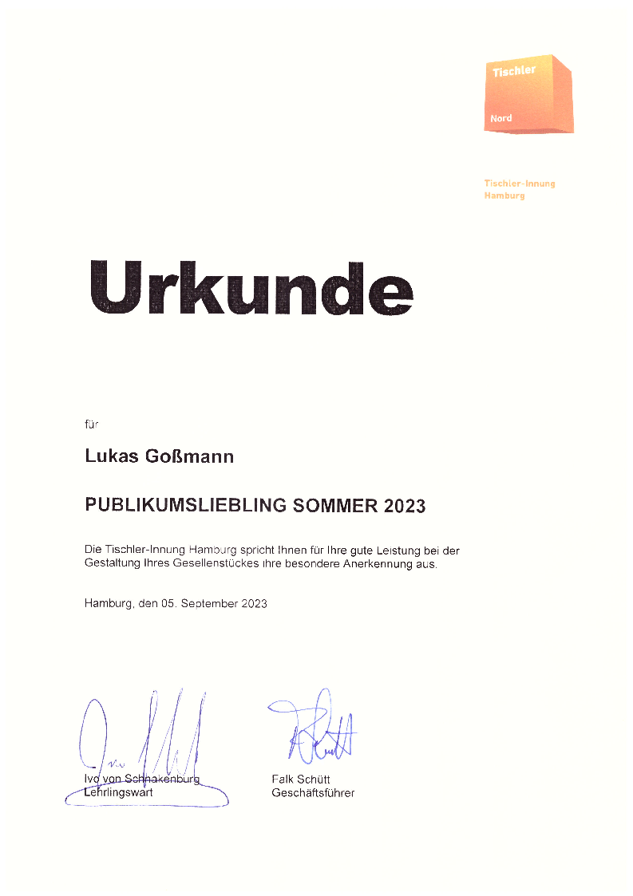

# The clockwork
The clock hands are moved by 2 Nema8 double shaft stepper motors (one hollow shaft and one normal one).  
To allow the clock to move its hands smoothly and nearly completely silently the stepper motors are driven using 2 Trinamic TMC2209 SilentStepStick modules configured for 256x microstepping. `200 full steps * 256 micro steps = 51200 steps per rev`  
The structural parts of the clockwork are CNC cut from 3mm Resopal and slotted together.  
Unfortunately i mostly forgot to take pictures of the build process and the finished clockwork before installing it so only the CAD drawings show how everything fits together.

# The pendulum

Its driven by a small electromagnet at the frequency that the pendulum would naturally swing at.  
`Pendulum length = 350mm, Frequency = 0.8425Hz`  
The brass ring was made using a small ring rolling / metal bending machine and soldered together at the seam.  
For additional rigidity the pendulum shaft goes through the ring and is soldered to it at both the top and bottom.  
Inside of the ring are 2 circular slices of purple heart wood with slots for the shaft to pass through.  
They are just press fit in place and can be removed with a suction cup in case the brass needs to be re-polished.  

# The bell mechanism
Originally the design of the clock included a 5 tone bell mechanism that used solenoids which hit against brass rods.  
This part of the design was later abandoned due to the bells not sounding that good.  
The new design of the clockwork no longer includes the bells.  
There is a few pictures of the old assembly in the pictures folder.

 

# The dial plate

Its made from Corian that has been engraved with a 1mm carbide endmill.  
The engraving was then filled with black epoxy and a brass ring.  
After that everything was sanded flush and polished.  

 

# The electronics
The brain of this clock is a Raspberry Pi Pico. In total 4 PWM units are used to control the clock. 2 PWM units are used to drive the hands.  
The first PWM unit drives the minute hand at `(200 full steps * 256 microstepping)/(60 seconds * 60 minutes) = 14.22222222222222222Hz` which is still within reach of the PWM unit at normal system clock speeds.  
However the hour hand needs a step pulse at just 1/12th of this frequency `1.18518518519Hz` which is way too low for the PWM units to reach.  
So instead of generating the hour pulse directly, the second PWM unit is configured to be driven by the output of first pwn unit (using an external jumper) and just divides the frequency by 12.  
  
The same idea is also used to drive the very low frequency PWM output for the pendulum.  
In that case a 10khz clock is divided down to the desired frequency and the pulse width is adjustable as well for different power supply voltages.  

The time can be set through a text prompt via a USB serial terminal.  
When the time is set the clock hands automatically home, using 2 optical limit switches, and after that drive to the set time.  
At night the clock also goes into a power saving mode where the clock hands and the pendulum stop moving.  
When powering back up the clock hands home again and drive to the current time.  

There is unfortunately not very many pictures of the PCB itself because i again forgot to take pictures.  
I managed to find it in the background of some pictures of other projects though so i cropped out the unimportant bits (which is also why the quality of those pictures isn't great...)

 

# The lock

The lock is custom designed for this clock. It can be used for all types of full overlay doors when the door is at least 12mm or so thick (the lock is just 9mm thick).  
Once installed the lock and latch plate don't take up any space inside whatever enclosure they are used in.  
The latch of the lock is moved using an eccentric cam whose center of rotation is the key shaft.  
A small plastic spring is used to give some audible and haptic feedback on when the key has been rotated far enough.  

 

# The case
It was actually build as my journeyman's piece for the apprenticeship as a carpenter I completed in August of 2023.  
The case consists of 2 big half circles that were made by gluing ten 2mm pieces of veneer together while clamped to a mold.  
After the glue dries the pieces keep the shape and are actually surprisingly stiff.  
All the relevant documents that have to be submitted (Drawings, Concept, etc.) to get the project approved are also available in this repository for anyone interested.  
That is also why the repository contains a mix of German and English.  
To document the build process and show how certain things were made (in case anyone wants to replicate the project) I took a lot of pictures while building it.  
The clock was on display at the Forum Alstertal in Hamburg, Germany at the yearly exhibition of carpentry journeyman's pieces:  
`30th of June to the 05th July 2023`  
[Link to the event](https://www.forum-alstertal.de/news_veranstaltungen_detail_394.html)

# Awards

During the exhibition the residents living at the Forum Alstertal get the opportunity to vote on their favorite piece.
This year my clock won the audience award.
